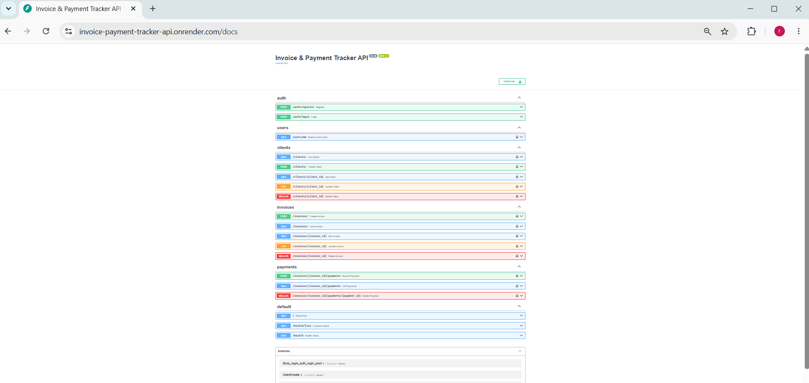
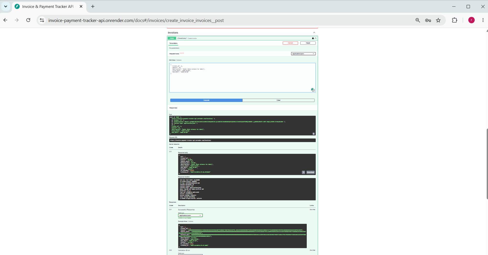
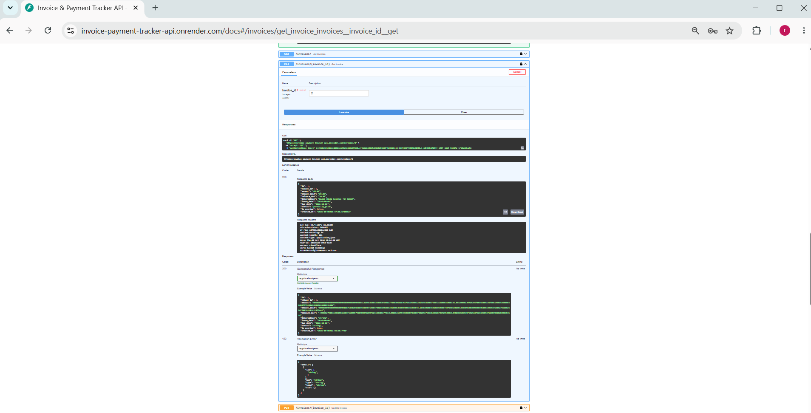

# Invoice & Payment Tracker API

A multi-user REST API for small businesses to manage clients, invoices and payments, with automatic invoice status tracking and strict per-user data isolation.

**Tier:** 1 (Junior) · Project 1 of my portfolio roadmap
**Status:** Complete: deployed, tested (66 tests, 97% coverage) and smoke-tested live

- **Live API:** https://invoice-payment-tracker-api.onrender.com
- **Interactive docs (Swagger UI):** https://invoice-payment-tracker-api.onrender.com/docs

> The free hosting tier sleeps after 15 minutes without traffic, so the first request can take about a minute. After that it responds normally.

This project is an **API only**; there is no separate frontend. The Swagger page at `/docs` is the interface: register, click **Authorize**, and try every endpoint from the browser.

## Screenshots






## Problem

Most small business owners track who owes them money in a spreadsheet, which breaks down quickly once there are more than a handful of clients. This API is the backend for a proper tool: each business owner manages their own clients, invoices and payments, and the system works out what is paid, partly paid or overdue.

## What it does

| Area | Endpoints |
|---|---|
| Auth | `POST /auth/register`, `POST /auth/login` (returns a JWT), `GET /users/me` |
| Clients | `POST/GET /clients/`, `GET/PUT/DELETE /clients/{id}` |
| Invoices | `POST/GET /invoices/`, `GET/PUT/DELETE /invoices/{id}` |
| Payments | `POST/GET /invoices/{id}/payments`, `DELETE /invoices/{id}/payments/{payment_id}` |
| Health | `GET /health/live` (is the process up), `GET /health` (can it reach the database) |

Every invoice response includes values that are **calculated, not stored**: `amount_paid`, `balance_due` and `is_overdue`. The status (`unpaid`, `partially_paid`, `paid`) is recalculated whenever a payment is added or removed.

## Architecture

```
Request → FastAPI router → Pydantic validation → service layer → SQLAlchemy → PostgreSQL
                │                                      │
         JWT auth dependency                 ownership + status logic
                │
        central error handlers → one JSON error format
```

- `app/routers/`: thin HTTP layer, one module per resource.
- `app/services.py`: shared business rules (ownership lookups, locking, status recalculation).
- `app/models.py` / `app/schemas.py`: database tables and request/response shapes, kept separate on purpose.
- `app/errors.py`: every error, including validation failures, database conflicts and unexpected crashes, comes back in the same shape: `{"error": {"code", "message", "fields"?}}`.
- `alembic/`: versioned database migrations.

## Key decisions

These are the choices I would explain in an interview:

1. **Other users' data returns 404, not 403.** A 403 tells an attacker "that ID exists, it just isn't yours". 404 reveals nothing. Ownership is checked through a join (invoice → client → user), and a dedicated test file attacks every endpoint with a second user's token.
2. **Money is `Decimal` / `Numeric(12,2)`, never float.** Floats cannot represent values like 0.10 exactly, which causes cents to drift. Input is rejected if it has more than two decimal places.
3. **Status and balance are derived from the payments, not typed in by the user.** The API cannot end up saying "paid" while the payments say otherwise.
4. **Row locking when recording payments** (`SELECT ... FOR UPDATE`), so two simultaneous payments can't both pass the "does this exceed the balance?" check. *Designed in, but not load-tested; see the limitations below.*
5. **409 vs 422 are used deliberately.** 422 means the input itself is malformed. 409 means the input is fine but conflicts with the current state (overpaying, deleting a client that still has invoices, lowering an invoice below what's already been paid).
6. **Tests run against a real PostgreSQL, not SQLite,** so they exercise the same constraints and behaviour as production. Each test runs inside a transaction that is rolled back, so tests can't affect each other and the whole suite finishes in about 4 seconds.
7. **Fail fast on bad configuration.** The app refuses to start without `SECRET_KEY` instead of running with an insecure default.
8. **Production database on Neon, not Render's free Postgres,** because Render's free database expires after 30 days. The web service and database are on separate providers.
9. **Two health checks.** `/health/live` never touches the database, so a database blip doesn't make the host restart a healthy app. `/health` checks the database for deeper diagnosis.
10. **Built around a locked-down machine.** I have no admin rights, so Docker couldn't be installed. Tests use an embedded Postgres (`pgserver`) that needs no installation, and the Dockerfile was validated by a clean-environment import check and then by Render's real cloud build.

## Tech stack

| Layer | Choice |
|---|---|
| Language / framework | Python 3.11, FastAPI |
| Database | PostgreSQL (Neon in production) |
| ORM / migrations | SQLAlchemy 2.0, Alembic |
| Validation | Pydantic v2 |
| Auth | JWT via `python-jose`; password hashing with `bcrypt` |
| Testing | pytest, pytest-cov, httpx, embedded Postgres via `pgserver` |
| Packaging / deploy | Docker (`python:3.11-slim`, non-root user), Render (free tier) |

## How to run it locally

You need Python 3.11 and a PostgreSQL database. A free [Neon](https://neon.tech) project is the easiest option and needs no local install. Commands are for Windows PowerShell.

1. Clone and enter the project:

   ```powershell
   git clone https://github.com/akorfaa/invoice-payment-tracker-api.git
   cd invoice-payment-tracker-api
   ```

2. Create and activate a virtual environment, then install the dependencies:

   ```powershell
   python -m venv venv
   .\venv\Scripts\Activate.ps1
   pip install -r requirements-dev.txt
   ```

3. Create your settings file from the template, then open `.env` and fill in `DATABASE_URL` and `SECRET_KEY` (the template explains how to generate a key):

   ```powershell
   Copy-Item .env.example .env
   ```

4. Create the database tables:

   ```powershell
   alembic upgrade head
   ```

5. Start the server, then open http://127.0.0.1:8000/docs:

   ```powershell
   uvicorn app.main:app --reload
   ```

### Run the tests

```powershell
pytest -q
```

No setup is needed: the first run starts a temporary local PostgreSQL inside the project (in `.pgdata/`) using `pgserver`. To test against your own database instead, set `TEST_DATABASE_URL`; the database name **must end in `_test`**, which is a safety check so the tests can never wipe a real database.

For a coverage report: `pytest --cov=app --cov-report=term-missing`

### Smoke-test a deployed copy

```powershell
python scripts/smoke_test_live.py https://invoice-payment-tracker-api.onrender.com
```

This runs a 15-step flow against the live API (register, log in, create a client and invoice, pay it in two parts, check the status and the error cases). Each run leaves one throwaway `smoke_...@example.com` user in the database.

### Deployment notes

- Render builds the `Dockerfile`; the container listens on `$PORT`. Environment variables (`DATABASE_URL`, `SECRET_KEY`) are set in Render's dashboard, not in the repo.
- Migrations are run manually from my machine against the production database (`alembic upgrade head`), because Render's free tier has no pre-deploy command.
- The service is hosted in Oregon and the database in Frankfurt, so each request pays some extra latency. Fine for a portfolio project; I'd co-locate them in production.

## What I'd improve with more time

**Product**
- Pagination and filtering on list endpoints (by status, client, date range).
- Soft-delete or "void" for invoices and payments, plus an audit trail. Real accounting systems don't hard-delete financial records.
- Multi-currency support (relevant for GHS/USD invoicing) and PDF invoice generation.
- Refresh tokens, and rate limiting on login and registration. Registration is currently open to anyone.

**Engineering**
- Move business-rule errors out of the routers into domain exceptions in `services.py`, so the service layer doesn't depend on HTTP.
- Request IDs and structured JSON logging for debugging in production.
- CI (GitHub Actions) to run the tests and `alembic upgrade head` on every push, instead of running migrations by hand.
- Load-test the payment row-locking with truly concurrent requests. The test suite uses one connection per test, so it cannot reproduce a real race.
- Consolidate a few older test files that still define their own copy of the auth-header helper.

**Operations**
- Automated database backups (the free Neon plan has limited restore options).
- At least two instances and an always-on plan; on the free tier a single instance sleeps when idle.

## Project layout

```
app/            FastAPI app: routers, models, schemas, services, security, errors
alembic/        Database migrations
tests/          pytest suite (66 tests)
scripts/        Live smoke test and a local-Postgres check
Dockerfile      Production image
requirements.in / requirements.txt / requirements-dev.txt
```
